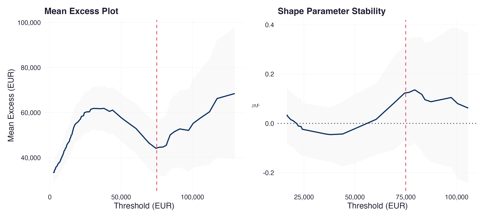
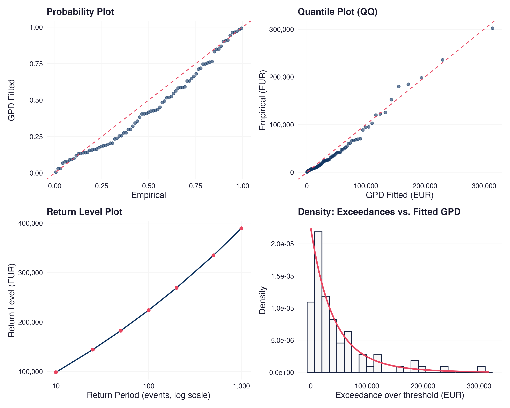

```{r}
#| label: setup
#| echo: false

library(kableExtra)
library(knitr)
library(plotly)
library(scales)
library(sessioninfo)
library(tidyverse)

# ------------------------------------------------------------------------------
# Brand color variables
# ------------------------------------------------------------------------------
brand_primary   <- "#1A1A2E"
brand_secondary <- "#16213E"
brand_accent    <- "#0F3460"
brand_highlight <- "#E94560"
brand_surface   <- "#F5F5F5"
brand_text      <- "#1A1A2E"

brand_palette <- c(
  primary   = brand_primary,
  secondary = brand_secondary,
  accent    = brand_accent,
  highlight = brand_highlight
)

# ------------------------------------------------------------------------------
# theme_brand(): consistent ggplot2 theme for all static figures in this document
# ------------------------------------------------------------------------------
theme_brand <- function(base_size = 12) {
  theme_minimal(base_size = base_size) +
    theme(
      panel.grid.minor = element_blank(),
      panel.grid.major = element_line(color = "#E5E5E5", linewidth = 0.3),
      plot.title       = element_text(color = brand_text, face = "bold", size = base_size + 1),
      plot.subtitle    = element_text(color = "#6E6E73", size = base_size - 1),
      plot.caption     = element_text(color = "#6E6E73", size = base_size - 3, hjust = 0),
      axis.title       = element_text(color = brand_text),
      axis.text        = element_text(color = brand_text),
      strip.text       = element_text(color = brand_text, face = "bold"),
      legend.position  = "bottom",
      legend.title     = element_text(color = brand_text)
    )
}

# ------------------------------------------------------------------------------
# Load data
# ------------------------------------------------------------------------------
loss_register <- read_csv("data/loss_register.csv", show_col_types = FALSE) |>
  mutate(event_date = as.Date(event_date))

threshold_diagnostics <- read_csv("data/threshold_diagnostics.csv", show_col_types = FALSE)
gpd_fit_params        <- read_csv("data/gpd_fit.csv", show_col_types = FALSE)
capital_comparison    <- read_csv("data/capital_comparison.csv", show_col_types = FALSE)
qq_pp_data            <- read_csv("data/qq_pp_data.csv", show_col_types = FALSE)
return_level_data     <- read_csv("data/return_level_data.csv", show_col_types = FALSE)
stability_results     <- read_csv("data/stability_results.csv", show_col_types = FALSE)
annual_maxima         <- read_csv("data/annual_maxima.csv", show_col_types = FALSE)

# ------------------------------------------------------------------------------
# Convenience extractions from gpd_fit_params (long format: parameter, estimate, std_error)
# ------------------------------------------------------------------------------
get_param <- function(name) {
  gpd_fit_params |> filter(parameter == name) |> pull(estimate)
}

xi_hat            <- get_param("shape_xi")
sigma_hat         <- get_param("scale_sigma")
selected_threshold <- get_param("threshold_eur")
n_exceedances      <- get_param("n_exceedances")
n_total            <- get_param("n_total")
gev_shape          <- get_param("gev_shape_xi")
gev_n_years        <- get_param("gev_n_years")

xi_se    <- gpd_fit_params |> filter(parameter == "shape_xi") |> pull(std_error)
sigma_se <- gpd_fit_params |> filter(parameter == "scale_sigma") |> pull(std_error)
```

## Introduction: When the Average Fails You

The accuracy of a capital model is dependent on the accuracy of its assumptions regarding what occurs at the edges. That assumption is never explicitly tested in most operational risk frameworks. They fit a log-normal distribution to a loss history, extrapolate to the 99.9th percentile, and refer to this as a capital requirement. The fit is reasonable in the middle of the distribution where most of the data resides and the extrapolation is rarely compared with another model. This is the question this document asks: When losses move into the tail, is it appropriate to discuss log normal models?

The more difficult and important part of operational risk capital work has always been the explicit modelling of the tail, as opposed to relying on central-tendency statistics scaled up. It still exists today, despite the fact that the regulatory framework around it is fundamentally different since January 2025, when the EU's CRR3/CRD6 package eliminated the Advanced Measurement Approach and replaced it with a formula-based Pillar 1 calculation, as this document does in "Regulatory Context and Capital Implications" where it is most relevant. In practice, the difference between modelling the tail and modelling the bulk is often respected procedurally rather than substantively, before and after the change. A risk function is used to choose a parametric family, fit it to the complete loss history, and then assume that goodness of fit in the bulk of the distribution is enough to justify the same for the tail. This inference is not valid. A distribution can be a good approximation to the median and the 90th percentile of a loss register and yet be far off the mark for the 99.9th percentile, since the mathematical conditions that are appropriate for the bulk of the register are not the conditions that govern the tail.

This distinction is the reason for the existence of Extreme Value Theory. Instead of assuming a single model for all losses in a loss history and hoping it extrapolates correctly, EVT asks a more focused question: If the losses are only those that exceed some high threshold, what distribution describes these losses? The answer is the Generalized Pareto Distribution, broadly speaking, and not because it is assumed to be correct, but because of a theorem that says it is correct for any well-behaved underlying loss process. This is a different type of evidence from goodness-of-fit in the bulk and it's the evidence this document brings to NexaCore Financial Technologies' operational loss register.

The next question is not an academic question. When the log-normal model and the GPD model differ significantly at the 99.9th percentile in terms of capital required, one of them is incorrect by a significant amount, which is important for a capital adequacy committee. This paper measures that dismay, offers some understanding of why it exists, and asks what should be done about it by a CRO.

## Operational Loss Data: NexaCore's Register

NexaCore's operational loss register spans five years (2020–2024) and 500 recorded events, classified under the standard Basel II taxonomy of seven event types. Execution, Delivery, and Process Management losses dominate by count — a pattern consistent with published industry loss data for payments-intensive fintech operations — but count is not the same as severity. External Fraud and Clients, Products, and Business Practices events occur less frequently and carry substantially higher average losses, a divergence visible in the table below.

```{r}
#| label: tbl-loss-summary
#| tbl-cap: "NexaCore Operational Losses by Basel Event Type, 2020–2024"

loss_summary <- loss_register |>
  group_by(basel_event_type) |>
  summarise(
    n_events       = n(),
    median_loss    = median(net_loss_eur),
    mean_loss      = mean(net_loss_eur),
    total_loss     = sum(net_loss_eur),
    .groups = "drop"
  ) |>
  arrange(desc(total_loss))

loss_summary |>
  kable(
    format    = "html",
    digits    = 0,
    col.names = c("Basel Event Type", "Events (n)", "Median Loss (€)", "Mean Loss (€)", "Total Loss (€)"),
    format.args = list(big.mark = ",")
  ) |>
  kable_styling(
    bootstrap_options = c("striped", "hover", "condensed"),
    full_width        = TRUE,
    position          = "left",
    font_size         = 13
  )
```

External Fraud and Clients, Products, and Business Practices together account for a disproportionate share of total losses relative to their event counts — the signature of a loss-generating process where severity, not frequency, drives exposure. This is precisely the pattern that a single distributional fit struggles to represent well across its full range.

```{r}
#| label: fig-loss-histogram
#| fig-cap: "Empirical Loss Distribution with Sub-Threshold Log-Normal Overlay (log scale)"
#| fig-height: 5.5

# Sub-threshold log-normal benchmark, fit to losses <= selected EVT threshold
# (consistent with the model used throughout Section 3.7; see INSTRUCTIONS.md
# Section 11 for the rationale behind fitting to sub-threshold losses only)
sub_threshold_losses <- loss_register |> filter(net_loss_eur <= selected_threshold) |> pull(net_loss_eur)
ln_fit <- MASS::fitdistr(sub_threshold_losses, "lognormal")
ln_meanlog <- ln_fit$estimate["meanlog"]
ln_sdlog   <- ln_fit$estimate["sdlog"]

hist_breaks <- 10^seq(log10(min(loss_register$net_loss_eur)), log10(max(loss_register$net_loss_eur)), length.out = 40)

# Curve data is deliberately restricted to the sub-threshold range only -- the
# log-normal model was never fit beyond this point, and drawing the curve past
# the threshold would visually imply an extrapolation the document explicitly
# argues against.
#
# Density correction: geom_histogram(aes(y = after_stat(density))) on a
# log10-transformed x-axis computes density per unit of log10(x), not per
# unit of x. The raw dlnorm() density is in linear-euro units and is several
# orders of magnitude too small to compare visually. The standard correction
# multiplies by the Jacobian of the transform, x * ln(10), to express density
# in the same log10-space units the histogram bars are using.
curve_x <- 10^seq(log10(min(loss_register$net_loss_eur)), log10(selected_threshold), length.out = 200)
curve_data <- tibble(
  x = curve_x,
  density = dlnorm(curve_x, meanlog = ln_meanlog, sdlog = ln_sdlog) * curve_x * log(10)
)

p_hist <- ggplot(loss_register, aes(x = net_loss_eur)) +
  geom_histogram(aes(y = after_stat(density)), breaks = hist_breaks,
                  fill = brand_surface, color = brand_secondary, alpha = 0.8) +
  geom_line(data = curve_data, aes(x = x, y = density), color = brand_highlight, linewidth = 1) +
  geom_vline(xintercept = selected_threshold, color = brand_highlight, linetype = "dashed", linewidth = 0.6) +
  scale_x_log10(labels = label_comma(), breaks = scales::trans_breaks("log10", function(x) 10^x)) +
  labs(
    x = "Net Loss (EUR, log scale)",
    y = "Density",
    caption = "Red line: log-normal density fit to sub-threshold losses, shown only across the range it was\nfit to. Dashed line: selected EVT threshold (€75,000). Losses beyond this point are modeled\nseparately via the Generalized Pareto Distribution in Sections 3.5–3.7."
  ) +
  theme_brand()

p_hist
```

The histogram's right tail is sparse by construction — large losses are rare — but the events that populate it are an order of magnitude larger than the bulk of the register. The log-normal curve, shown only across the range it was fit to, stops at the dashed threshold line rather than extending into that territory. Extending it anyway, which is standard practice when log-normal serves as the sole loss model, is the assumption the remainder of this document tests directly.

## The Theoretical Case Against Log-Normal

The use of the log-normal as a loss model is based on some implicit assumption of the Central Limit Theorem: aggregate a large number of independent, finite-variance random effects, and the resulting distribution approaches a familiar and well behaved distribution. It is not clear that operational losses meet the conditions that make this convergence reliable. Loss events are not random, but tend to occur in clusters, and severity is not constrained by a natural ceiling like many physical processes. If the process underlying the model gives rise to occasional extreme events, which are not merely large draws from a process that has the same distribution as the events with smaller magnitudes, but draws from a qualitatively different regime, then the asymptotic guarantees that support a thin-tailed distribution are no longer valid. Even though it doesn't fit the data well on a single scale, it can fit the data reasonably well in the aggregate, since the maximum likelihood estimation is designed to optimize the likelihood of the bulk of the data, which is where most of the data lies. It does not indicate whether the fit is correct for an extrapolation to a quantile that is rarely approached by most of the data.

The theoretical basis for the treatment of the tail separately is provided by the Pickands–Balkema–de Haan theorem, which describes the convergence of the distribution of exceedances above a high threshold to a Generalized Pareto Distribution for a wide range of underlying distributions. This result is true for any parent distribution, whether it be log-normal, gamma, or even one that doesn't have a convenient closed form. This is why Peaks-Over-Threshold isn't just another parametric guess. It is a model which has a theoretical guarantee, but which is only applicable to the region a risk model has to get right – not a global fit which happens to be evaluated at an extreme quantile.

The shape parameter ξ in the fitted GPD is the actual diagnostic. If ξ equals zero, the tail is exponential, which is the regime that is consistent with thin-tailed parent distributions, such as log-normal at the limit. If ξ is greater than zero, the tail is polynomial (and thins out much more slowly), meaning that there is a lot more probability mass in large losses than any thin-tailed model would suggest. Whether NexaCore's loss generating process is in the first category or the second depends on the sign and magnitude of ξ, not on the goodness of fit statistics from a log-normal model fit to the bulk.

## Threshold Selection: Mean Excess Plot and Parameter Stability

Peaks-Over-Threshold requires choosing a threshold above which the Generalized Pareto approximation is treated as valid, and that choice is the method's primary degree of freedom. Set the threshold too low, and the data below it contaminates the tail fit with observations that do not belong to the extreme regime. Set it too high, and too few exceedances remain to estimate the shape and scale parameters with any precision. Two complementary diagnostics inform the choice: the mean excess plot, and the stability of the fitted shape parameter ξ as the threshold varies.

```{r}
#| label: fig-mep-stability
#| fig-cap: "Mean Excess Plot and Shape Parameter Stability"


```

The stability panel is the more telling one here. For fitted ξ below about €50,000, the fitted ξ is unstable and is often negative, indicating that the exceedance sample is still dominated by the bulk of the loss distribution. Above €50,000, ξ is positive and the confidence band is squeezed. If the selected threshold is r scales::dollar(selected_threshold, prefix = "€") then ξ has reached a relatively stable positive value, as is necessary for the GPD approximation to be reliable according to Peaks-Over-Threshold theory.

The mean excess plot provides a better qualified picture. If the data were a textbook MEP, it would start to increase about linearly from the threshold up. The MEP, on the other hand, exhibits a local decrease in mean excess around the chosen threshold, followed by an increase at higher thresholds in NexaCore. This is not uncommon in samples of this size — in finite samples, the sampling noise in the mean excess statistic is significant, and a single exceedance that is much smaller than the rest near the threshold can cause exactly this kind of local dip without suggesting that the GPD assumption is incorrect. The MEP is used here as supporting evidence, rather than as the deciding evidence: the stability plot is used to support the threshold choice, but the MEP does not contradict it.

The number of exceedances out of the total loss events is `r n_exceedances` with a threshold of €75,000, such that the standard errors of the shape and scale parameters are sufficiently small to support the capital comparison in "Capital Estimates: GPD vs. Log-Normal vs. Historical Simulation", and the number of exceedances is large enough that the fitted GPD describes a subset of the loss experience that is truly extreme, and not just the ordinary course of business, for NexaCore.

## GPD Fitting and Tail Diagnostics

The Generalized Pareto Distribution fitted to NexaCore's exceedances above €75,000 produces the parameter estimates below.

```{r}
#| label: tbl-gpd-params
#| tbl-cap: "Fitted GPD Parameters"

gpd_param_table <- tibble(
  Parameter = c("Shape (ξ)", "Scale (σ)"),
  Estimate  = c(xi_hat, sigma_hat),
  `Std. Error` = c(xi_se, sigma_se)
)

gpd_param_table |>
  kable(
    format = "html",
    digits = 4,
    col.names = c("Parameter", "Estimate", "Std. Error")
  ) |>
  kable_styling(
    bootstrap_options = c("striped", "hover", "condensed"),
    full_width        = TRUE,
    position          = "left",
    font_size         = 13
  )
```

The estimated shape parameter is positive: ξ = `r round(xi_hat, 3)`, with a standard error of `r round(xi_se, 3)`. The implied 95% confidence interval spans roughly −0.13 to 0.37 and therefore does not exclude zero, a direct consequence of estimating a tail shape parameter from `r n_exceedances` exceedances rather than the thousands a purely statistical test would prefer. The point estimate nonetheless places NexaCore's operational losses in the Fréchet domain of attraction — the heavy-tailed regime in which polynomial decay, rather than exponential decay, governs the probability of extreme losses — and this reading is reinforced by the GEV cross-check below. Even at the pessimistic end of the estimated range, the GPD-implied capital requirement remains above the sub-threshold log-normal benchmark detailed in "Capital Estimates: GPD vs. Log-Normal vs. Historical Simulation," though the margin narrows considerably at the highest confidence level tested. Uncertainty in ξ is itself a finding: it is a direct, quantified expression of how much is still unknown about NexaCore's tail risk, which a model that does not estimate ξ at all cannot offer.

```{r}
#| label: fig-gpd-diagnostics
#| fig-cap: "GPD Diagnostic Panel: Probability, Quantile, Return Level, and Density"


```

The quantile plot is the most informative of the four panels. Empirical exceedances track the GPD-implied quantiles closely across nearly the entire range, including at the single largest recorded loss, which sits close to its theoretical position rather than appearing as an outlier the model fails to anticipate. The probability plot tells a more qualified story: points in the middle of the distribution — roughly the 30th to 75th percentile of exceedances — show a visible departure from the reference line, an S-curve pattern consistent with sampling variability in a sample of `r n_exceedances` exceedances rather than evidence of systematic mis-specification. The return level plot is monotonic and well-behaved across return periods out to 1,000 events, and the density panel shows the fitted GPD tracking the histogram of exceedances reasonably well given the inherent sparseness of data at the highest loss magnitudes.

As a cross-check independent of the threshold-based approach, a GEV distribution was fitted to NexaCore's `r gev_n_years` annual maximum losses (2020–2024). This fit produced an estimated shape parameter of `r round(gev_shape, 3)`, consistent in sign with the POT-based estimate and supporting the same heavy-tail conclusion. The result should be read as corroborating rather than confirmatory: five annual maxima provide too little data for the GEV fit's own standard errors to be informative on their own, and the cross-check's value lies in directional agreement with the POT result, not in any independent precision it offers.

## Capital Estimates: GPD vs. Log-Normal vs. Historical Simulation

Three models are compared at the confidence levels relevant to capital adequacy: 99%, 99.9%, and 99.95%. The GPD estimate uses the fitted parameters from "GPD Fitting and Tail Diagnostics." The log-normal estimate is fit to sub-threshold losses only — the model a risk function without an EVT framework would plausibly build, calibrated to the same €75,000 boundary the threshold diagnostics independently identified. Historical simulation uses the empirical quantiles of the full loss register directly, with no distributional assumption at all.

```{r}
#| label: tbl-capital-comparison
#| tbl-cap: "VaR and Expected Shortfall by Model and Confidence Level"

capital_table <- capital_comparison |>
  mutate(
    confidence_label = scales::percent(confidence_level, accuracy = 0.01),
    gap_pct_label     = scales::percent(gap_var_pct, accuracy = 0.1)
  ) |>
  select(confidence_label, VaR_gpd, VaR_lognorm, VaR_histsim, gap_var_eur, gap_pct_label)

capital_table |>
  kable(
    format = "html",
    digits = 0,
    col.names = c("Confidence", "VaR (GPD)", "VaR (Log-Normal)", "VaR (Hist. Sim.)", "Gap (€)", "Gap (%)"),
    format.args = list(big.mark = ",")
  ) |>
  kable_styling(
    bootstrap_options = c("striped", "hover", "condensed"),
    full_width        = TRUE,
    position          = "left",
    font_size         = 13
  ) |>
  column_spec(5, color = brand_highlight) |>
  column_spec(6, color = brand_highlight)
```

```{r}
#| label: fig-capital-bars
#| fig-cap: "Capital Estimates by Model and Confidence Level"
#| fig-height: 5.5

bar_data <- capital_comparison |>
  select(confidence_level, VaR_gpd, VaR_lognorm, VaR_histsim) |>
  pivot_longer(cols = -confidence_level, names_to = "model", values_to = "var_estimate") |>
  mutate(
    model = recode(model,
      "VaR_lognorm" = "Log-Normal (sub-threshold)",
      "VaR_gpd"     = "GPD (POT)",
      "VaR_histsim" = "Historical Simulation"
    ),
    model = factor(model, levels = c("Log-Normal (sub-threshold)", "Historical Simulation", "GPD (POT)")),
    confidence_label = paste0(scales::percent(confidence_level, accuracy = 0.01))
  )

ggplot(bar_data, aes(x = confidence_label, y = var_estimate, fill = model)) +
  geom_col(position = position_dodge(width = 0.75), width = 0.7) +
  scale_fill_manual(values = c(
    "Log-Normal (sub-threshold)" = brand_accent,
    "Historical Simulation"      = brand_secondary,
    "GPD (POT)"                  = brand_highlight
  )) +
  scale_y_continuous(labels = label_comma()) +
  labs(x = "Confidence Level", y = "VaR (EUR)", fill = NULL) +
  theme_brand()
```

At every confidence level tested, the GPD estimate exceeds the sub-threshold log-normal benchmark. At the 99th percentile, GPD VaR is `r scales::percent(capital_comparison |> filter(confidence_level == 0.99) |> pull(gap_var_pct), accuracy = 0.1)` higher than log-normal; at the 99.9th percentile, `r scales::percent(capital_comparison |> filter(confidence_level == 0.999) |> pull(gap_var_pct), accuracy = 0.1)` higher; at the 99.95th percentile, `r scales::percent(capital_comparison |> filter(confidence_level == 0.9995) |> pull(gap_var_pct), accuracy = 0.1)` higher. The percentage gap narrows as confidence rises, which might read as the discrepancy becoming less material at the quantiles that matter most. The euro figures say otherwise: the absolute gap is `r scales::comma(capital_comparison |> filter(confidence_level == 0.99) |> pull(gap_var_eur), prefix = "€")` at 99%, `r scales::comma(capital_comparison |> filter(confidence_level == 0.999) |> pull(gap_var_eur), prefix = "€")` at 99.9%, and `r scales::comma(capital_comparison |> filter(confidence_level == 0.9995) |> pull(gap_var_eur), prefix = "€")` at 99.95% — broadly stable in euro terms even as both models' estimates grow. Capital adequacy is set in euros, not percentages, and by that measure the under-capitalization risk from a log-normal model does not diminish at higher confidence levels.

Historical simulation tells a third story, and it is the more structurally interesting one. At the 99th percentile, the empirical quantile sits close to the GPD estimate, which is unsurprising — with `r n_total` observations, the 99th percentile is estimated from real data still inside the bulk of the observed range. At the 99.9th and 99.95th percentiles, historical simulation's Expected Shortfall estimate is identical across both confidence levels, pinned at the single largest loss the register contains. This is not a coincidence or a calculation error: once the required quantile exceeds what the sample can support, the empirical method has nowhere further to extrapolate. It is a structural ceiling, not a risk estimate, and it illustrates precisely the failure mode EVT is designed to avoid — a model that cannot represent a loss larger than any it has already observed is not a tail risk model at all.

## Regulatory Context and Capital Implications

The regulatory treatment of operational risk capital has evolved in such a way that this analysis is more relevant than ever. The Advanced Measurement Approach has been discontinued since the introduction of the EU's CRR3/CRD6 package in January 2025. The operational risk capital is now measured using the Standardized Measurement Approach, which consists of a formula based on a bank's Business Indicator and a multiplier based on the bank's historical loss experience, and which does not include any internal model or tail distribution. An institution can no longer use a GPD or log-normal fit to determine its Pillar 1 minimum capital requirement for operational risk. This distinction this document quantifies is not rendered obsolete, but transferred to another part of the framework.

The standardized formula is tested, on a case-by-case basis under the SREP process, to determine if it is sufficient to reflect an institution's actual risk level, which is based on factors including its loss rate. Where it does not, the shortfall is corrected by a capital add-on under Pillar 2. An institution that has measured its own tail risk using EVT is more likely to be a good candidate for such supervision as it has explicitly understood the problem of tail risk, whereas one that has only been relying on the implicit assumptions of the formula is less likely to be in a position to do so. The capital shortfall in "Capital Estimates: GPD vs. Log-Normal vs. Historical Simulation" is now a fact of a Pillar 2 determination, rather than a choice of Pillar 1 modeling, and an institution that does not create it cannot challenge one.

The same evidence is relevant in the inside whether Pillar 1 is computed in one way or another. An institution's Internal Capital Adequacy Assessment Process should be based on its own assessment of the risks it is exposed to, including those risks that are not parameterized in the standardized formula at the institutional level. A CRO that is based on the SMA output alone has made the decision based on the average industry experience rather than on NexaCore's register. One of the more direct paths to the internal view is through EVT, since it uses the institution's own data to estimate the tail behavior, rather than assuming a shape for it.

There is a constraint that comes with EVT that needs to be stated clearly. A large number of exceedances above threshold is needed for the method's asymptotic justification, and institutions with few loss histories will have GPD estimates with standard errors as large as those reported in "GPD Fitting and Tail Diagnostics. This is not something special about NexaCore's analysis, it's a property of extreme value estimation in general, and this is why there are external loss data consortia in operational risk. The question for such an institution is whether to augment internal data with external data, admit its uncertainty openly or risk the tail estimate having more model risk than the bulk of its capital model. None of these is equal to the default assumption of a log-normal fit in order to get a narrower confidence interval. An exact wrong answer is not better than a sincere "I don't know."

## Insights & Conclusion

There are three findings that are most significant in considering this analysis in the context of a capital adequacy committee.

Capital shortage is high, and it doesn't get smaller at the point of need. At the 99th percentile, the VaR derived from GPD is more than `r scales::percent(capital_comparison |> filter(confidence_level == 0.99) |> pull(gap_var_pct), accuracy = 0.1)`; at the 99.9th percentile, it is more than `r scales::percent(capital_comparison |> filter(confidence_level == 0.999) |> pull(gap_var_pct), accuracy = 0.1)`; at the 99.95th percentile, it is more than `r scales::percent(capital_comparison |> filter(confidence_level == 0.9995) |> pull(gap_var_pct), accuracy = 0.1)`. As the confidence increases, the percentage gap decreases, but the euro gap remains fairly constant at all three levels: `r scales::comma(min(capital_comparison$gap_var_eur), prefix = "€")` and `r scales::comma(max(capital_comparison$gap_var_eur), prefix = "€")`. A risk function that only takes the percentage column would be confused by this as a problem that will go away at higher confidence. It does not. Capital adequacy is fixed in euros, and the under-capitalization risk of a thin-tailed model is the same over the range of interest.

Estimated at r round(xi_hat, 4) with a standard error that is wide enough to leave the confidence interval covering zero, the shape parameter ξ is informative, not just inconclusive. It states that the loss-generating process of NexaCore is likely to be in the heavy-tailed Fréchet domain, but not yet sufficiently strong evidence to rule it out with high confidence, and that this uncertainty is not an artifact of poor modeling, but is irreducible at the current sample size. A single point estimate, as a log-normal capital figure would, without this context, is not more accurate, it's just silent about a question EVT answers in a straightforward manner.

Historical simulation's problem at extreme quantiles is not incidental, but structural. If the required confidence level is higher than what is possible with the sample, then the method's Expected Shortfall estimate remains at the maximum loss recorded in the sample. This is the most obvious example in the analysis of the need for a theoretical basis for extrapolation, rather than a bigger spreadsheet of historical losses, for a tail risk method.

None of this is an argument for wholesale changing of the capital structure at NexaCore. The Standardized Measurement Approach is the approach that will be used to calculate Pillar 1, regardless of the results of any internal model, which is unlikely to change as a result of one institution's EVT analysis. What this document calls for is more limited and more immediately actionable: EVT should be part of the institution's internal toolkit, rather than just a one-off exercise, in the context of the institution's ICAAP capital view and its approach to Pillar 2 supervisory review. If the committee that sets capital requirements has never conducted this comparison, it doesn't know if it has the right, or too conservative, or too optimistic, understanding of the tail risk. It takes only five years of loss history and a threshold diagnostic to discover.

## Session Information

```{r}
#| label: session-info
#| echo: false

sessioninfo::session_info()
```

------------------------------------------------------------------------

Rendered with [Quarto](https://quarto.org/). Tables formatted with `kableExtra`. Visualizations built with `ggplot2`. Extreme value analysis and diagnostic figures were produced upstream by `compute_evt.R` using `evd`, `POT`, `fitdistrplus`, and `patchwork`; see "GPD Fitting and Tail Diagnostics" above for the corresponding results.
